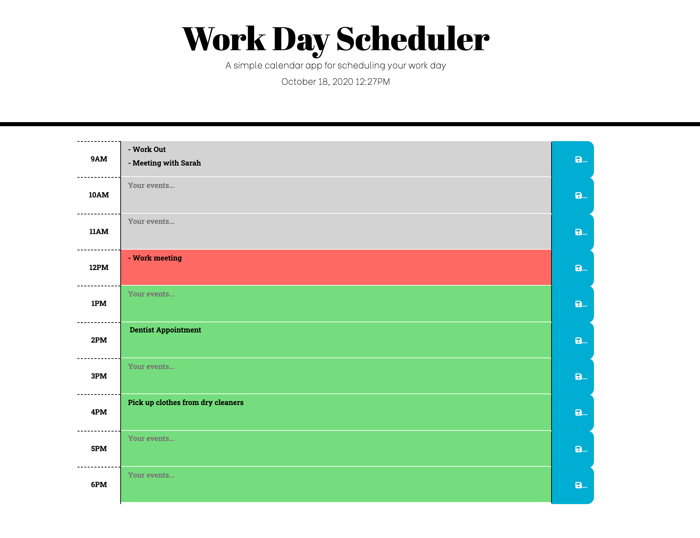

# Work-day-schedule
 
 A work day schedule is very useful for anyone living a busy lifestyle.  

Deployed link for the schedule: https://sumaya198.github.io/WorkDayScheduler/

# Installation and Usage

Using HTML, CSS, Bootstrap, Javascript and JQuery the work day schedule is functional and responsive on all the following devices: desktop, laptop, tablet and mobile. You can use the schedule to view the current time and date and write down the events planned for the day. The events are color coded based on times that have passed (grey), the current time (red) and future times (green). The events can be saved to local storage and can will remain on the page even after the page is refreshed.

# Credits
## Third party assets
 The following assets were used to create the work schedule
* Momement.js
* Font Awesome
* Bootstrap
* jQuery 

## Research
Some research tools used to create the work schedule
* W3Schools
* gitHub
* Google

# Screenshot

